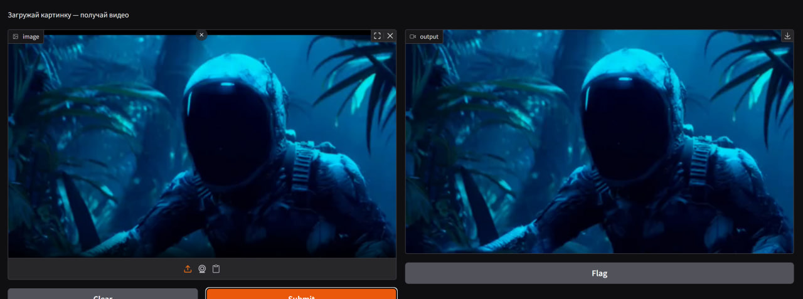

#  Отчёт по проекту: дообучение модели Wan2.2-TI2V-5B

## Цель проекта
Дообучить модель **Wan2.2-TI2V-5B** для генерации видео из изображений (*Image-to-Video*) и видео из текста (*Text-to-Video*).  
Результат - улучшенная модель с простым **API** и **UI** для тестирования.

---

## Структура проекта

```bash
.
├── api/ - FastAPI сервис (инференс, генерация видео)
├── ui/ - пользовательский интерфейс
├── src/ - код обучения и инференса
├── notebooks/ - эксперименты и тесты
```
---

## Что уже сделано
- Разработан **API-сервис** для генерации видео (`FastAPI` + `Docker`)
- Реализован минимальный **UI** для визуальных тестов
- Проведён базовый **инференс модели WAN TI2V**
- Подготовлен **тренировочный скрипт** (`src/train.py`) с поддержкой LoRA
- Создана структура будущего датасета (видео + reference frame)

---

## Что планируется
1. **Собрать и обработать датасет** (обрезка, FPS, разрешение)  
2. **Дообучить модель**
3. **Интегрировать обновлённую модель** в API/UI  
4. **Подготовить демонстрационные примеры** до/после обучения

---

## Основные блокеры
- Жесткая нехватка  GPU-памяти (см. readme_experimtent.md)  
- Потенциальное переобучение при малом датасете  

---
## Демонтсрация UI + Api


